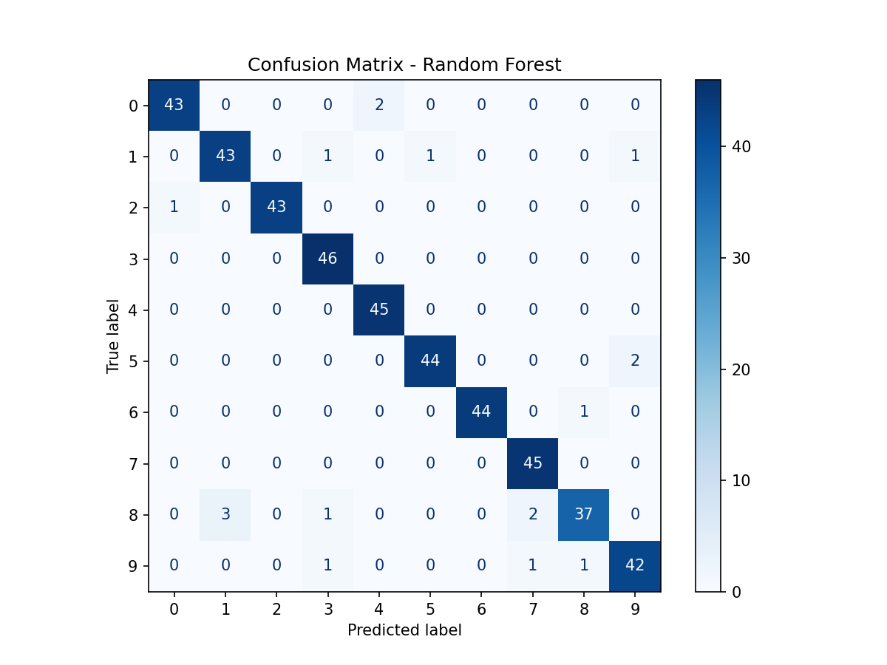
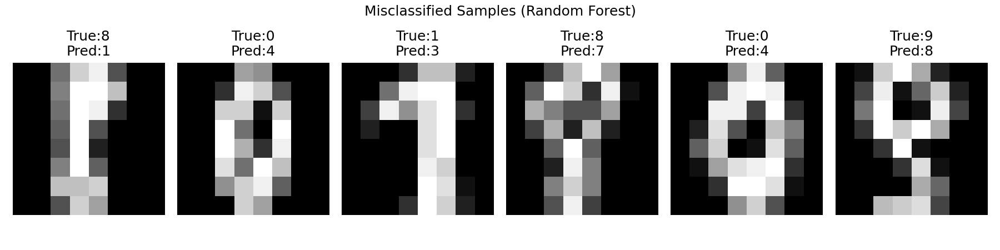

# 传统机器学习方法在手写数字图像分类中的应用

## 一、实验目的

1. 理解图像如何转换为机器学习模型可用的特征向量。
2. 掌握训练集与测试集的划分方式及各自作用。
3. 熟悉至少五种传统机器学习分类算法的基本原理与使用方法。
4. 比较不同分类器在同一图像分类任务中的性能差异。
5. 学会使用准确率、混淆矩阵和错误样本分析来评价分类结果。

## 二、数据集说明

| 项目         | 内容                                 |
|--------------|--------------------------------------|
| 数据集名称   | sklearn 内置手写数字数据集 (digits) |
| 图像大小     | 8×8 像素                            |
| 样本数量     | 1797 张                              |
| 类别数量     | 10 类（数字 0~9）                   |
| 特征表示     | 每张图像按行展开成 64 维灰度值向量   |

## 三、实验方法

| 方法               | 简要说明                                       |
|--------------------|----------------------------------------------|
| KNN                | 根据最近邻样本的多数类别进行投票分类           |
| Naive Bayes        | 基于特征条件独立性假设，利用贝叶斯公式分类     |
| Logistic Regression| 构建线性决策边界，用概率估计进行多分类         |
| SVM                | 寻找最大间隔超平面，可使用核函数处理非线性     |
| Decision Tree      | 通过特征阈值不断划分，形成树状分类规则         |
| Random Forest      | 集成多棵决策树，通过投票提高稳定性与准确性     |

## 四、实验结果

### 4.1 不同模型测试准确率对比

| 模型               | 测试准确率 |
|--------------------|------------|
| KNN                | 0.9844     |
| Naive Bayes        | 0.8289     |
| Logistic Regression| 0.9622     |
| SVM                | 0.9911     |
| Decision Tree      | 0.8244     |
| Random Forest      | 0.9600     |

### 4.2 模型表现分析

- **准确率最高**：SVM（99.11%），略优于 KNN（98.44%），说明在 64 维像素特征下，带有 RBF 核的 SVM 能够很好地拟合复杂的非线性决策边界，且泛化能力出色。
- **准确率最低**：Decision Tree（82.44%），单棵决策树极易过拟合训练数据中的噪声和局部特征，导致测试性能大幅下降。
- **差异是否明显**：非常明显，最高与最低相差约 16.7 个百分点。
- **差异原因**： 
  - 线性模型如逻辑回归无法捕捉像素间的非线性交互，但其正则化能力使其表现尚可（96.22%）；
  - 朴素贝叶斯特征独立假设过强，难以处理像素间的相关性，准确率仅 82.89%；
  - 决策树深度较大时几乎无偏、但方差极高，容易陷入过拟合；
  - 随机森林通过 Bagging 和特征随机性降低了方差，准确率提升至 96.00%，但仍低于 SVM 和 KNN；
  - SVM 与 KNN 均能直接处理高维空间中的复杂形状，鲁棒性强，故名列前茅。

### 4.3 错误样本分析（以 Random Forest 为例）

随机森林是一个综合表现较优的模型，以下分析其错误分类情况。

#### （1）混淆矩阵

主对角线为正确分类样本数，非对角线展示错误流向。可以看出某些数字间存在较明显的混淆，例如 8 被误判为 1，0 被误判为 4 等。

#### （2）错误分类样本展示

上图为部分被随机森林错误分类的样本，标题中 True 为真实标签，Pred 为预测标签。可以看出这些数字的书写风格比较特殊或形状模糊，人眼有时也难以分辨。

#### （3）最易混淆的数字组合

通过统计错误样本中的真实-预测标签对，得到前 5 组混淆：

| 真实标签 → 预测标签 | 错误次数 |
|---------------------|----------|
| 8 → 1               | 3        |
| 0 → 4               | 2        |
| 8 → 7               | 2        |
| 5 → 9               | 2        |
| 1 → 3               | 1        |

#### （4）错误原因分析

- **8 与 1、7 混淆**：某些 8 的书写上半部未闭合或下半部过于笔直，在 8×8 的低分辨率下容易丢失关键形状细节，被模型识别为 1 或 7。
- **0 与 4 混淆**：0 的顶部或右侧可能由于倾斜或笔画变细，与 4 的轮廓相似。
- **5 与 9、1 与 3**：同样源于手写风格的不规范，使得类别边界附近的样本被误判。

这些错误表明，在仅使用原始像素作为特征的情况下，模型无法获得平移、旋转或尺度不变性，对书写风格变化敏感，容易在高相似度类别之间发生混淆。

## 五、实验总结

1. **传统机器学习处理图像的基本流程**：加载图像 → 将二维图像展平为固定长度特征向量 → 划分训练集与测试集 → 选择多种分类器进行训练与预测 → 使用准确率、混淆矩阵等指标评估模型性能。
2. **不同分类器的优缺点**：
   - KNN：简单直观、无需训练，但预测阶段计算成本高，对噪声和维度敏感；
   - 朴素贝叶斯：计算高效，适用于高维数据，但特征独立假设常不成立，精度受限；
   - 逻辑回归：可解释性好，支持概率输出，但对非线性特征需人工组合或核技巧；
   - SVM：凭借核函数可处理复杂决策边界，泛化能力强，但在大规模数据上训练较慢；
   - 决策树：可解释性强，能自动选择重要特征，但极易过拟合；
   - 随机森林：通过集成学习降低方差，稳定性与准确率显著优于单棵决策树。
3. **使用原始像素作为特征的局限**：缺乏对图像平移、旋转、缩放和局部形变的不变性；对书写风格、笔画粗细和光照变化敏感；维度较高且存在大量冗余信息，无法提取高级语义特征。后续可用方向梯度直方图（HOG）、局部二值模式（LBP）等手工特征或深度学习进行改进。

## 六、思考题

1. **为什么传统机器学习方法需要先把图像转换为特征向量？**  
   传统算法（如逻辑回归、SVM、决策树等）均基于向量化的数值输入进行数学运算，无法直接处理二维网格结构或变长数据。将图像展平为向量，使其符合模型的输入形式要求。

2. **KNN、SVM、决策树和随机森林的分类思想有什么不同？**  
   - KNN：基于距离度量，利用最近的 k 个训练样本的标签进行多数投票；
   - SVM：寻找最大化类间间隔的超平面，通过核函数将数据映射到高维空间实现非线性分类；
   - 决策树：递归地选择最佳特征和阈值划分数据，构造树状决策规则；
   - 随机森林：集成多棵基于样本和特征随机采样的决策树，通过投票或平均得到最终结果。

3. **为什么单棵决策树容易过拟合？**  
   决策树倾向于不断生长，直至每个叶节点只包含极少数样本或全部纯净，从而学习到训练数据中的噪声和偶然规律，导致在未见过的测试数据上表现很差。

4. **为什么随机森林通常比单棵决策树更稳定？**  
   随机森林通过 Bootstrap 采样和随机特征选择生成大量差异化的决策树，最终的集成输出平均了各树的误差，显著降低了模型方差，因此泛化性能更稳定。

5. **如果图像发生平移、旋转或缩放，直接使用原始像素作为特征会有什么问题？**  
   像素值会随图像变换发生巨大变化，相同数字的特征向量可能完全不同，导致模型无法正确识别。原始像素特征不具备几何不变性，对图像变形非常敏感，这也是传统视觉任务中需要设计不变性特征的重要原因。